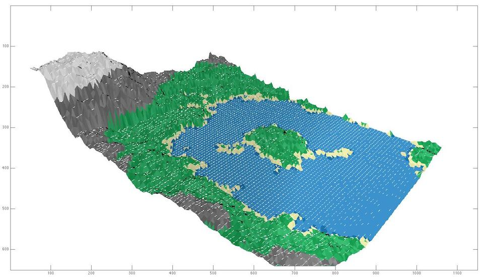

landscape-generation
====================

Simple 3D renderer using Matlab [INSA Lyon (France) lab work]

## Objectives

The aim of this lab project was to create a simple 3D renderer. We implemented the following features:

- Use the diamond-square algorithm to add detail to a terrain described by a height map
- Tesselate a height map
- Apply a perspective transform (with configurable camera position and look-at direction)
- Choose colors based on height
- Apply a simplified Phong illumination model
- Rasterize using the painter's algorithm as well as the Z-buffer algorithm

## Known issues

- The implementation of the rasterizing algorithm that we used leaves some pixels white
- There is no support for shadows